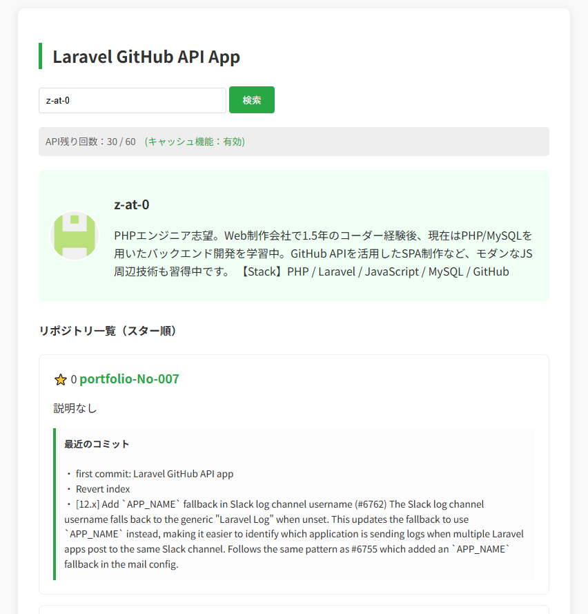
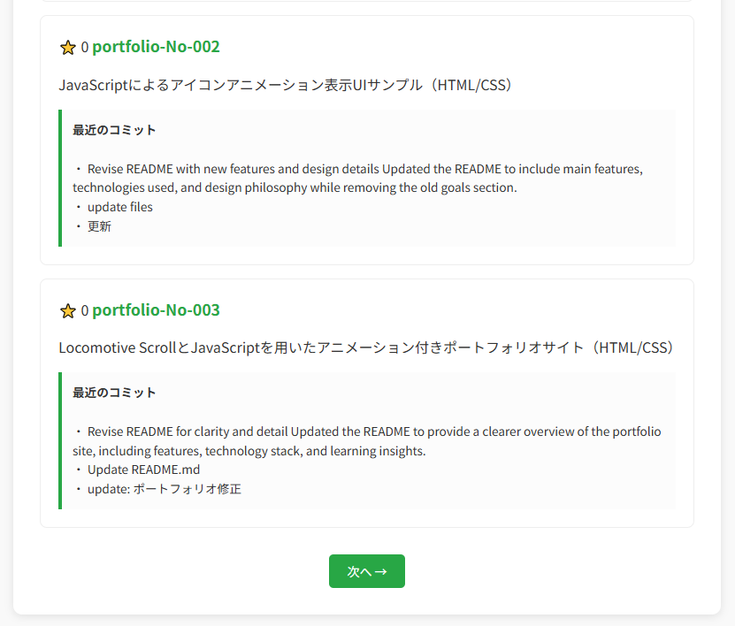
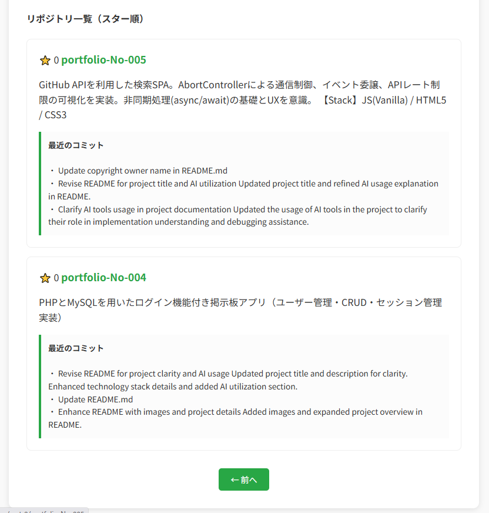

# portfolio-No-007: Laravel GitHub API App (Cache & MVC Logic)

---

## 概要

GitHub APIを利用して、ユーザー情報やリポジトリを検索・表示するLaravelアプリケーションです。  
外部APIの利用制限に対し、サーバーサイドでキャッシュ機構を利用することで、リクエスト数を削減し実用性を高めた設計を重視しています。

---

## 画面イメージ

### 1. トップページ

検索画面イメージ シンプルな検索画面デザイン。

### 2. APIレート制限の可視化及び検索結果・リポジトリ一覧



検索結果イメージ 現在のAPI残り回数と、キャッシュ機能が有効であることをユーザーに提示。  
スター順のソート、キャッシュされたコミット履歴、スマートなページネーション。  
検索結果に対して「次へ」や「前へ」のUIも考慮。

### 3. サーバーサイド・キャッシュ管理
キャッシュ構造イメージ Laravel Cacheを利用し、APIレスポンスを一定時間保持する設計。

---

## 主な機能

GitHubユーザー検索: アカウント情報、アイコン、自己紹介（Bio）の取得  
リポジトリ管理: PHPのusortによるスター数順のソート、ページネーション表示  
詳細プレビュー: 各リポジトリの最新3件のコミット履歴をキャッシュ連携で高速取得  
自作キャッシュ機構: Laravel Cacheを利用し、APIレスポンスを10分間保持  
API制限対策: キャッシュにより不要なAPI呼び出しを削減  

---

## 使用技術

使用言語: PHP (8.2), Laravel 12, HTML, CSS  
技術要素:  
Laravel HTTP Client (Http Facade)  
Laravel Cache  
Bladeテンプレート  
GitHub REST API  

---

## 設計方針

単にAPIを叩くだけでなく、「限られたリソース（API制限）をいかにバックエンドの工夫で守るか」という実務的な課題解決を意識して設計しました。  
Laravelのキャッシュ機能を活用し、外部APIへの依存を最小化する構成としています。

---

## 動作環境

本アプリケーションはPHPおよびLaravelを使用しているため、ローカル開発環境（XAMPP / Laravel環境）で動作します。

---

## セットアップ方法

リポジトリをクローン  
git clone https://github.com/z-at-0/portfolio-no-007.git  

依存関係インストール  
composer install  

環境設定  
cp .env.example .env  
php artisan key:generate  

サーバー起動  
php artisan serve  

http://127.0.0.1:8000/github  

---

## ディレクトリ構成
```text
portfolio-No-007  
├ app/Http/Controllers/GitHubController.php  
├ resources/views/github.blade.php  
├ routes/web.php  
└ .env  
```
---

## 学習・AI活用について

本プロジェクトでは、実装理解およびデバッグ補助の目的でAIツール(ChatGPT)を活用しています。

■ 活用範囲  
Laravel MVC構造の理解  
キャッシュ設計の検討  
GitHub APIレスポンス構造の解析  
Controller設計の改善支援  

■ 主体性について  
コードはすべて一行ずつ内容を確認して構築しています。  
キャッシュキー設計やAPI取得構造は、自身で調整・改善を行っています。

■ 補足  
006（PHP単体構成）と比較し、本プロジェクトではLaravelを用いたMVC構造への移行とキャッシュ機構の標準化を行っています。

---

© 2026 Y.K
